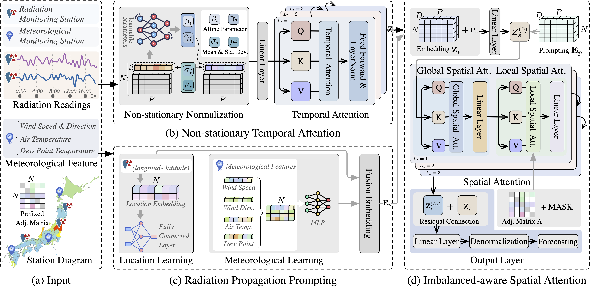

# NRFormer: A Spatio-Temporal Graph Transformer for National-Wide Nuclear Radiation Forecasting

| **[1 Introduction](#1-introduction)** 
| **[2 Requirements](#2-requirements)**
| **[3 Datasets](#3-dataset)**
| **[Website](https://tfeilyu.github.io/NRFormer-Demo/index.html)** |

## 1 Introduction

Official code for article "NRFormer: A Spatio-Temporal Graph Transformer for National-Wide Nuclear Radiation Forecasting".

Nuclear radiation (NR), which refers to the energy emitted from atomic nuclei during decay, poses substantial risks to human health and environmental safety. Accurate forecasting of nuclear radiation levels is crucial for informed decision-making by both individuals and governments. However, this task is challenging due to the imbalanced distribution of monitoring stations over a wide spatial range and the non-stationary radiation variation patterns. In this study, we introduce NRFormer, an innovative framework tailored for national-wide prediction of nuclear radiation variations.

  

## 2 Requirements

`python=3.9`,`torch=1.13.1+cu116`

## 3 Dataset

Our raw data is available at "[OneDrive](https://hkustgz-my.sharepoint.com/:f:/g/personal/tlyu077_connect_hkust-gz_edu_cn/EoxDZN0A8f9FiPXcPLjkqGUBfQZ2lraJdm2dD1pULnT2Zw?e=1gUKNu)".

