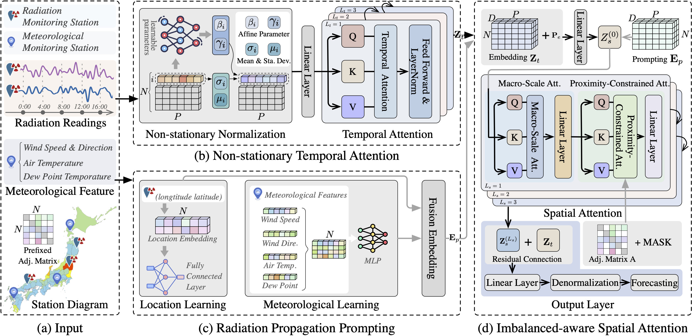

# NRFormer: A Spatiotemporal Imbalance-Aware Transformer for Nationwide Nuclear Radiation Forecasting

<p align="center">


</p>

<p align="center">

| **[1 Introduction](#introduction)** 
| **[2 Requirements](#requirements)**
| **[3 Usage](#usage)**
| **[4 Code structure](#code-structure)** 
| **[5 Datasets](#dataset)**
| **[Interactive Web-based Forecasting Platform](https://nrformer.github.io/)** |

</p>

<a id="introduction"></a>
## 1 Introduction

Official code for article "NRFormer: A Spatiotemporal Imbalance-Aware Transformer for Nationwide Nuclear Radiation Forecasting".

Nuclear radiation, which refers to the energy emitted from atomic nuclei during decay, poses significant risks to human health and environmental safety. Recently, the proliferation of the Web of Things (WoT) has facilitated the effective recording of nuclear radiation levels and related factors, such as weather conditions. The abundance of web-sourced data enables the development of accurate and reliable nuclear radiation forecasting models, which play a crucial role in informing decision-making for individuals and governments. However, this task is challenging due to the imbalanced distribution of monitoring stations over a wide spatial range and the non-stationary radiation variation patterns. In this study, we introduce NRFormer, a framework tailored for the nationwide prediction of nuclear radiation variations. By integrating a non-stationary temporal attention module, an imbalance-aware spatial attention module, and a radiation propagation prompting module, NRFormer collectively captures complex spatio-temporal dynamics of nuclear radiation. Extensive experiments on two real-world datasets demonstrate the superiority of our proposed framework against 11 baselines. This research not only enhances the accuracy and reliability in nuclear radiation forecasting but also contributes to advancing emergency response strategies and monitoring systems, thereby safeguarding environmental and public health. 
<div style="display: flex; justify-content: center;">
  
</div>


<a id="requirements"></a>
## 2 Requirements
You can install the requirements.txt package using pip:

```shell
pip install -r requirements.txt
```

## 3 Usage
<a id="usage"></a>
The parameters are fully configured, and the code is ready to run directly.

```shell
bash run.sh
```

## 4 Code structure
<a id="code-structure"></a>
- `model_settings`: This directory contains configuration files and settings specific to each dataset. 
- `src`: This directory holds all the files related to the implementation of models. It includes the core modules such as model architecture definitions, utility functions, and any custom layers or components used in the project.
- `train.py`: A standalone script designed to handle the training process of the models. It includes functionalities like loading datasets, initializing models, setting up optimizers, and iterating through training epochs. It also includes logging and checkpoint saving.
- `test.py`: A dedicated script for evaluating the performance of the trained models. It loads the pre-trained model and test dataset, runs inference, and calculates performance metrics.


## 5 Dataset
<a id="dataset"></a>
Our datasets are available at [Google Drive](https://drive.google.com/drive/folders/1KCDbDPzqVgu88o6C6jxEueFTt1P2pW1C?usp=sharing).


